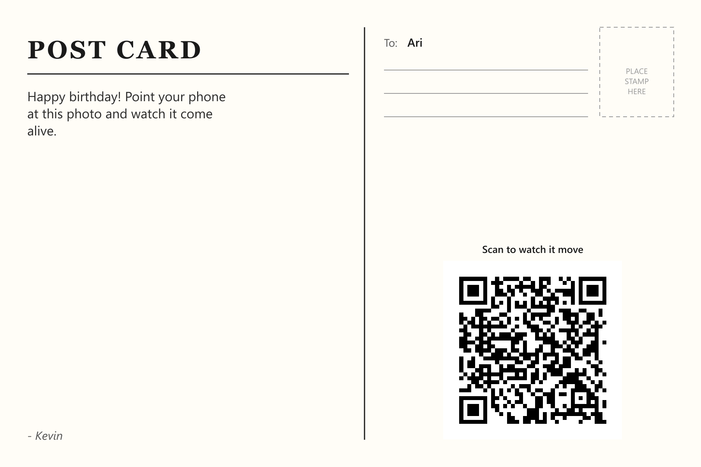

# AR Postcard Studio

Upload a photo and a message. Get back a print-ready postcard whose QR
code opens a WebAR page where the photo comes to life on your phone's
camera.

[](https://github.com/kevin-ayalaaragon/ar-postcard-studio/actions/workflows/ci.yml)
[](https://nextjs.org)
[](https://www.typescriptlang.org)
[](https://www.prisma.io)
[](LICENSE)



*A real, generated output from this app's `/api/postcards/[slug]/print/back` endpoint - not a mockup.*

## Contents

- [What it does](#what-it-does)
- [How it works](#how-it-works)
- [Tech stack](#tech-stack)
- [Getting started](#getting-started)
- [Environment variables](#environment-variables)
- [Architecture & decisions](#architecture--decisions)
- [Deployment](#deployment)
- [Roadmap](#roadmap)
- [Related project](#related-project)
- [License](#license)

## What it does

This is the full-stack, multi-user successor to
[ar-birthday-postcard](https://github.com/kevin-ayalaaragon/ar-birthday-postcard) -
a one-off, hardcoded WebAR birthday card built as a single gift. This app
generalizes that idea into a real submission pipeline that anyone can use.

## How it works

1. **Submit** (`/`) - a sender uploads a photo, writes a message, and
   names a recipient. This creates a `SUBMITTED` postcard record.
2. **Prepare AR assets (admin, manual for now)** - an admin runs the
   sender's photo through MindAR's
   [image target compiler](https://hiukim.github.io/mind-ar-js-doc/tools/compile/)
   to get a `.mind` tracking file, prepares the matching `.mp4` overlay,
   and uploads both via `/admin`. This flips the record to `READY`.

   > Auto-generating the `.mind`/`.mp4` from the photo instead of this
   > manual step is deliberately out of scope for this MVP - see
   > [Roadmap](#roadmap).

3. **View** (`/postcard/[slug]`) - a WebAR page that tracks the printed
   photo and plays the video on top of it, live camera required.
4. **Print** - the admin downloads print-ready front/back files
   (`/api/postcards/[slug]/print/front` and `.../print/back`, the latter
   pictured above) to send to a print shop.

## Tech stack

| Layer | Choice | Why |
|---|---|---|
| Framework | Next.js 16 (App Router, TypeScript) | One deployable for pages + API routes - see [ADR 0002](docs/adr/0002-nextjs-monolith.md) |
| Database | Prisma + SQLite (dev) / Postgres (prod) | Type-safe queries, pinned to a stable major - [ADR 0003](docs/adr/0003-database-orm.md) |
| AR viewer | MindAR.js + A-Frame | Free/open image tracking, carried over from the predecessor project - [ADR 0008](docs/adr/0008-ar-viewer-reuse.md) |
| Print generation | `sharp` + SVG rasterization | Fast, print-quality text layout - [ADR 0005](docs/adr/0005-print-file-generation.md) |
| QR codes | `qrcode` (error correction `H`, 4-module quiet zone) | Print/scan reliability - [ADR 0004](docs/adr/0004-qr-generation.md) |
| File storage | Local disk (dev), swappable to S3-compatible (prod) | [ADR 0006](docs/adr/0006-file-storage.md) |

## Getting started

**Prerequisites:** Node.js 20.9+ (developed against 24), npm.

```bash
npm install
cp .env.example .env   # then set a real ADMIN_SECRET (see below)
npx prisma migrate dev
npm run dev
```

- `http://localhost:3000` - submission form
- `http://localhost:3000/admin` - admin dashboard (enter the `ADMIN_SECRET` from `.env`)

Uploaded/generated files land under `./storage/` (gitignored, local dev
only).

## Environment variables

| Variable | Purpose | Dev default |
|---|---|---|
| `DATABASE_URL` | Prisma connection string | `file:./dev.db` (SQLite) |
| `ADMIN_SECRET` | Shared secret for the admin asset-upload endpoint - see [ADR 0007](docs/adr/0007-admin-auth.md) | generate your own |
| `PUBLIC_BASE_URL` | Base URL baked into each postcard's QR code | `http://localhost:3000` |
| `LOCAL_STORAGE_DIR` | Where the local storage driver writes files | `./storage` |

Full reference with comments: [`.env.example`](.env.example).

## Architecture & decisions

Every non-obvious technical choice - including ones synthesized rather
than hand-picked - is recorded with a cited source in
**[docs/adr/](docs/adr/README.md)** (MADR format). Resume-relevant skills
this build demonstrates are tracked in
[docs/differentiators.yaml](docs/differentiators.yaml).

## Deployment

Not yet deployed. Needs, at minimum: a hosted Postgres database
(`DATABASE_URL`), S3-compatible object storage in place of the local
storage driver, and a real `ADMIN_SECRET`. Any Node-capable host works -
this is a standard Next.js app with no exotic runtime requirements.

## Roadmap

- [ ] Auto-generate the `.mind` target and animation from the uploaded
      photo instead of the manual admin step.
- [ ] Real session/OAuth-based admin auth ([ADR 0007](docs/adr/0007-admin-auth.md)).
- [ ] S3-compatible object storage in production ([ADR 0006](docs/adr/0006-file-storage.md)).
- [ ] Deploy (Postgres + object storage wired up).

## Related project

[ar-birthday-postcard](https://github.com/kevin-ayalaaragon/ar-birthday-postcard) -
the original single-use WebAR birthday card this project generalizes.
That repo is a printed, already-delivered gift and is intentionally left
untouched - see [ADR 0001](docs/adr/0001-new-repo-not-rename.md).

## License

[MIT](LICENSE)
